# Running a Virtual Development Machine

A virtual machine (VM) is an emulation of a particular computer system. This system can be based on an existing or hypothetical machine. As a user we can create such virtual machines and install an operating system of choice on them. This allows us to run a Linux distribution while working on a Windows machine and vice versa.

Several software packages are available to create and run virtual machines. Examples are VMware, Hyper-V  which comes with Windows 8, Oracle VirtualBox, ... For our labs we will be using VirtualBox as this is free, lightweight, easy to use and available for Windows, Linux, Mac and Solaris.

!!! note "Hyper-V"
	Hyper-V, codenamed Viridian and formerly known as Windows Server Virtualization, is a native hypervisor; it can create virtual machines on x86-64 systems. Starting with Windows 8, Hyper-V supersedes Windows Virtual PC as the hardware virtualization component of the client editions of Windows NT.

## Installing Virtual Box

Start by going to the download section of the website of VirtualBox (https://www.virtualbox.org/). Download the VirtualBox platform package for your system. At the moment of this writing the current version of VirtualBox is 5.0.20. When running the installer package make sure to install VirtualBox with all features enabled as shown in the figure below.

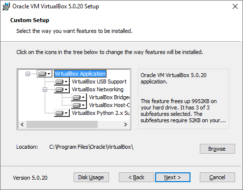
:   Installing VirtualBox with all features enabled

Next we also need to install the extension pack which introduces USB2.0 and USB3.0 support and some other extra features. You can download the extension pack on the same page as you downloaded the installer for VirtualBox. Just make sure to pick the correct version for your current VirtualBox version.

The installer of VirtualBox should also have created a virtual network adapter (such as can be seen in the figure below) which is used for private networking between the host machine and the virtual machine.

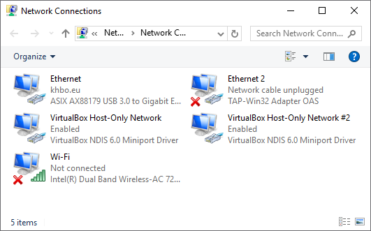
:   VirtualBox virtual network adapters

Once you’re finished you can start the VirtualBox client and you should get the interface presented in the figure below:

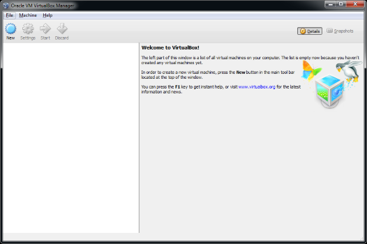
:   Launching VirtualBox after installation

Under `Files => Preferences => General` you can change the default path for your virtual machines. Do take note that you will need about 25GB of free space for each VM. For these labs you will most likely only need 1 VM.

Under `Files => Preferences => Language` you can also change the default interface language if you wish.

## Creating a Virtual Machine

Creating a virtual machine is very simple as it just following the steps presented to you by the wizard. To start the process of creating a VM hit the New button on the main interface of VirtualBox.

The first step consist of giving your VM a name and selecting the operating system you will be running on the VM as shown in the figure below. In our case we will use Linux Mint 17.3 (Rosa) - Cinnamon (64-bit). More on this later.

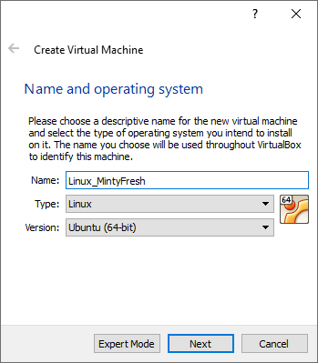
:   Creating a VM - The name and OS

Next we need to select the amount of memory we want to assign to the virtual machine. The recommended amount is 512MB. However if you have more than 4GB, select 1024MB or even 2048MB, which will improve the responsiveness and performance of the VM.

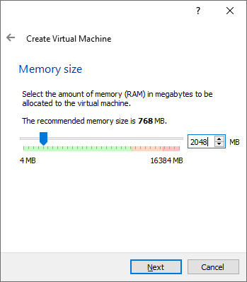
:   Creating a VM - Amount of memory

Next we need to choose what if we want to create a new or use an existing virtual hard drive. Pick the option to create one now as depicted in the figure below. This will launch another wizard which will lead us through the creation process of a virtual drive.

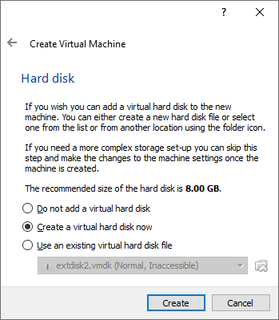
:   Creating a VM - Virtual hard drive

The first screen will allow us to select what type of virtual drive file we want to create. Just leave the default option (VDI – Virtual Disk Image).

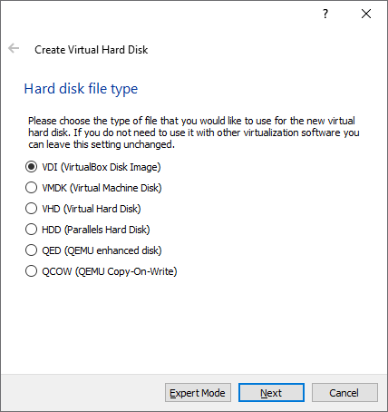
:   Creating a VM - Hard drive file type

In the next step we get the option to create a dynamically allocated image or a fixed size image as can be seen in the figure below. A fixed size image is faster but will take up the full space we select for the size of the virtual drive. A dynamically allocated image is slower but will only grow in size when needed. You will need to decide this for yourself based on the free space available on your host system.

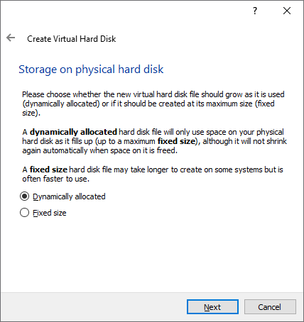
:   Creating a VM - Virtual drive allocation method

Now we need to select the hard drive file location (leave it as is) and size of the drive. Make sure to select **at least 25GB for the size** as shown in the figure below. Hitting create will finish the process of creating a VM.

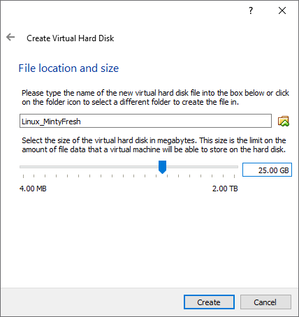
:   Creating a VM - Location and size of the virtual drive

Your new VM should now appear in the list of VM's on the left side of the VirtualBox main interface. Selecting a VM in the list also displays some basic information about the VM.

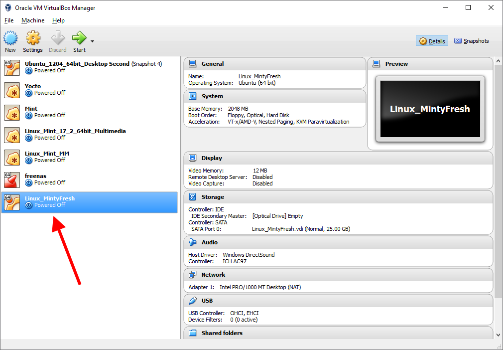
:   A new VM is added to your current list of VM's

## Configuring the Virtual Machine

Before installing an operating system on the newly created VM it is necessary to make a few configuration changes. Select the new VM and hit the *Settings* button on the main interface. You will be presented with the configuration settings of your VM.

Start by going to `General => Advanced` and enabling the *bidirectional shared clipboard*. This allows text to be copied to the clipboard in the VM and pasted in your host OS and vice versa. Also enable *bidirectional Drag'n Drop*. The resulting configuration is shown in the figure below.

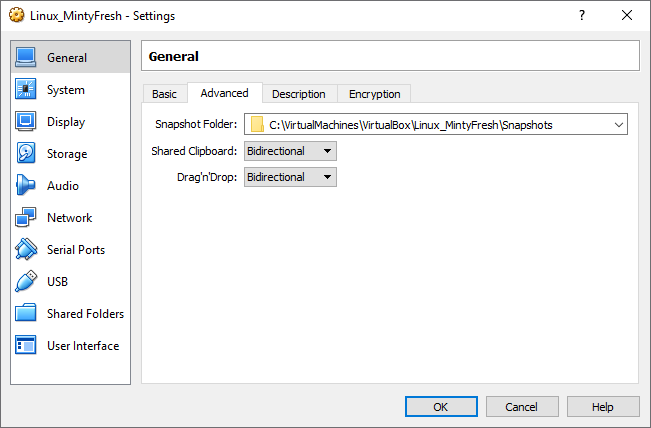
:   Configure VM to allow bidirectional clipboard and drag'n drop

Default the VM is configured with a single network adapter with NAT (Network Address Translation) enabled (Network tab). This means that the VM has access to the network and also has access to the Internet. However because of NAT we will not be able to connect to the VM from another machine using SSH without configuring port forwarding. Since later on in the LAB's we will need to do just that it is more convenient to change the network settings to a *Bridged Adapter* as shown in the figure below. Make sure to the select your physical Ethernet adapter to bridge with and not your wireless interface.

:   Configure VM to bridge the virtual and physical adapters

!!! note "Bridged Adapter"
	This will basically create a network bridge between the VM's network adapter and your physical host adapter making your VM's directly available on your network. This may be a security issue but can also simplify working with your VM. This option also implies that your VM will get its IP address from the same DHCP (Dynamic Host Configuration Protocol) server as your host machine if you have a DHCP enabled network.

## Installing an Operating System on the Virtual Machine

Before we can install an operating system on our virtual machine, it is necessary to download an installation image for the Linux distribution we will be using. This image can then be mounted on our VM allowing us to boot from it. In our case we will use Linux Mint 17.3 (Rosa) - Cinnamon (64-bit), which can be downloaded from [https://www.linuxmint.com/download.php](https://www.linuxmint.com/download.php). Make sure to select the 64-bit Desktop edition. Linux Mint is derivative of Ubuntu, but with a less intrusive graphical desktop environment.

Once downloaded start VirtualBox and open the setting of your VM. Next open the storage settings. Now select the virtual CD/DVD drive below the IDE controller as shown in step 1 in the figure below:

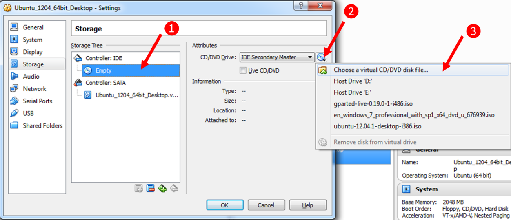
:   Steps for mounting an image in VirtualBox

Hit the small CD/DVD icon next to the IDE Secondary Master dropdown (step 2 in the figure above) and select Choose a virtual CD/DVD disk file ... A browse window will open; select the image file you downloaded from the Linux Mint website and hit OK. Hit the OK button of the setting panel to close it.

Ready ? Then hit the start button of the VM and follow the steps for installing the Linux Mint operating system. If you see the automatic boot screen shown below do nothing an let it pass. Linux Mint will boot in Live mode and allow you to start the install process from that point on.

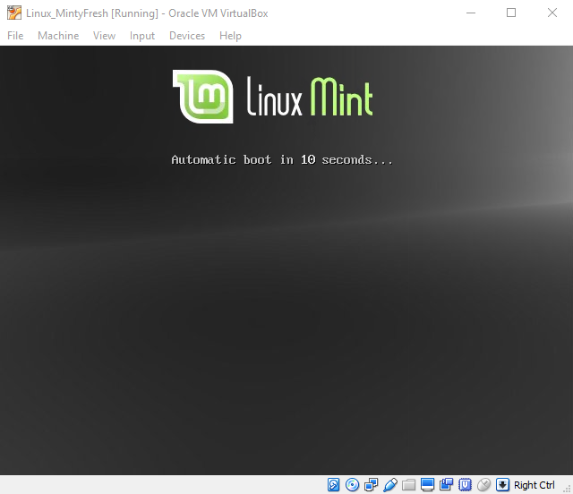
:   Live DVD or boot menu option

To start the installation process just double click the 'Install Linux Mint' icon on the desktop.

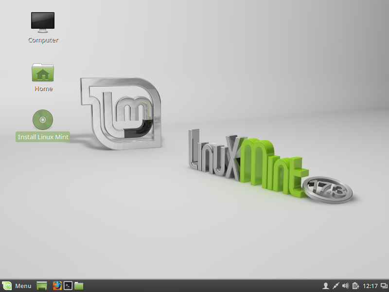
:   Starting the installation process

From this point on all steps are self-explanatory. Most of the installation steps can be kept to their default values.

If you click inside the VM window your mouse cursor will automatically be captured. Releasing your cursor can be achieved using the right CTRL key.

Once the installation procedure is finished you will be asked to reboot the VM.
